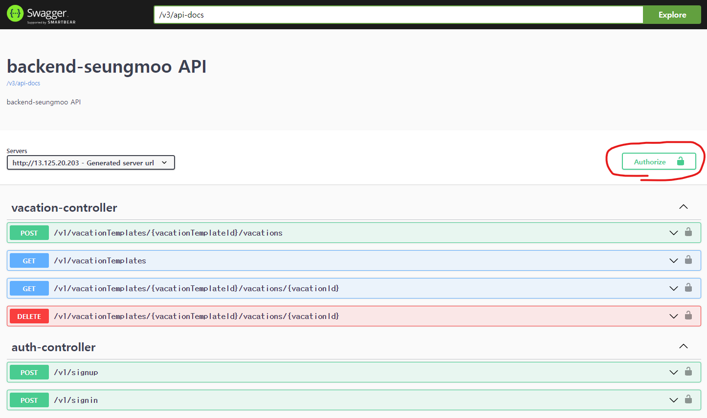

# 프로젝트 request-vacation

## 1) API 서비스 실행하기

   - host 인스턴스에서 gradle, docker, docker-compose 사전 셋팅이 필요합니다!
   - backend_dltmdan92 의 루트 디렉토리에서 [./run_adapter_api.sh](run_adapter_api.sh)를 실행해주시면 됩니다.

___

## 2) 서비스 스펙
   - Java 17, SpringFramework 5.3.27, SpringBoot 2.7.11, gradle 7.5.1, MySQL 5.7
   - 실행 환경: AWS EC2 (ubuntu 22, t2 medium), AWS RDS (Aurora MySql 5.7, db.t3.medium)
   - url: http://13.125.20.203
   - swagger url: http://13.125.20.203/swagger-ui.html

___

## 3) 서비스 구조
서비스 구조는 gradle multi sub-modules 형태로 구축하였습니다.
   
   - ### 내부 영역
     - domain
       - 주요 패키지 구성
         - aggregates: 도메인 객체의 클래스
         - repositories: 도메인 객체의 영속화를 담당하는 repository interface
       - 의존관계: configuration 모듈을 implement 하지만, 직접 참조하는 부분을 최소화하여 의존관계 최소화하였습니다. 
     - service
       - 주요 패키지 구성
         - 각 aggregate(user, vacation) 별 공통 서비스 로직을 구축했습니다.
         - 각 adapter들에게 core 로직을 제공하는 port 역할을 합니다.
       - 의존관계: domain 모듈을 의존합니다.
   - ### 외부 영역
     - adpater-api
       - 주요 패키지 구성
         - presentation layer: controller 관련 로직을 담당하며 client에게 제공할 API를 정의합니다.
           - service layer에 의존합니다. service layer는 presentation layer를 참조해신 안됩니다.
         - service layer: 각 adapter 별 service 로직을 담당합니다.
           - presentation layer는 service layer를 의존하고 참조합니다.
     - adapter-batch: batch job을 정의해둔 모듈입니다.

___

## 4) 서비스 요구사항 별 테스트 시나리오

### 1. 회원가입하기
   - API url: [POST] /v1/signup ([swagger-url](http://13.125.20.203/swagger-ui/index.html#/auth-controller/signup))
   - username, password, email에 적절한 값을 넣고, roles에는 MEMBER,ADMIN 값들만 허용됩니다.
   - response: 성공 시 201 Created 코드로 응답받습니다.

### 2. 로그인하기 (토큰 발급)
   - 선행 작업: [1. 회원가입하기](#1-회원가입하기)
   - API url: [POST] /v1/signin ([swagger-url](http://13.125.20.203/swagger-ui/index.html#/auth-controller/makeToken))
   - 회원가입 때 등록했던 email, password를 입력해주시면 됩니다.
   - response: 성공 시 200 OK, data에 JWT string을 리턴 받으실 수 있습니다.
   - 스웨거 사용하실 경우 Authorize 기능을 통해 token 인증해주시면 되겠습니다.
     -  

### 3. 휴가 템플릿/리스트 조회하기
   - 인증 필수!
   - 선행 작업: [1. 회원가입하기](#1-회원가입하기), [2. 로그인하기 (토큰 발급)](#2-로그인하기--토큰-발급-)
   - API url: [GET] /v1/vacationTemplates ([swagger-url](http://13.125.20.203/swagger-ui/index.html#/vacation-controller/getVacationTemplate))
     - queryParameters
       - year (int): 조회하실 년도 입력해주시면 됩니다.
     - headers
       - Authorzation: 2번(로그인하기) 단계에서 받으셨던 JWT를 Bearer 타입으로 넣어주시면 됩니다.
   - response: 성공 시 200 OK, data 필드에 vacationTemplate과 vacation 리스트를 리턴 받으실 수 있습니다.

### 4. 휴가 조회하기
   - 인증 필수!
   - 선행 작업: [1. 회원가입하기](#1-회원가입하기), [2. 로그인하기 (토큰 발급)](#2-로그인하기--토큰-발급-), [3. 휴가 템플릿/리스트 조회하기](#3-휴가-템플릿리스트-조회하기)
   - API url: [GET] /v1/vacationTemplates/{vacationTemplateId}/vacations/{vacationId} ([swagger-url](http://13.125.20.203/swagger-ui/index.html#/vacation-controller/getVacation))
     - url path resource
       - vacationTemplateId (long): /v1/vacationTemplates 에서 조회한 해당 vacationTemplateId를 입력해주시면 됩니다. 
       - vacationId (long): /v1/vacationTemplates 에서 조회한 해당 vacationId를 입력해주시면 됩니다.
     - headers
       - Authorzation: 2번(로그인하기) 단계에서 받으셨던 JWT를 Bearer 타입으로 넣어주시면 됩니다.
   - response: 성공 시 200 OK, data 필드에 해당 vacation 내역을 리턴 받으실 수 있습니다.

### 5. 휴가 신청하기
   - 인증 필수!
   - 선행 작업: [1. 회원가입하기](#1-회원가입하기), [2. 로그인하기 (토큰 발급)](#2-로그인하기--토큰-발급-), [3. 휴가 템플릿/리스트 조회하기](#3-휴가-템플릿리스트-조회하기)
   - API url: [POST] /v1/vacationTemplates/{vacationTemplateId}/vacations ([swagger-url](http://13.125.20.203/swagger-ui/index.html#/vacation-controller/requestVacation))
     - url path resource
       - vacationTemplateId (long): /v1/vacationTemplates 에서 조회한 해당 vacationTemplateId를 입력해주시면 됩니다.
     - request body
       - vacationType (enum): YONCHA(연차), BANCHA(반차), BANBANCHA(반반차)
       - startDate (date string): yyyy-MM-dd 형식
       - endDate (date string): yyyy-MM-dd 형식
       - comment (string): text
   - response: 성공 시 201 Created

### 6. 휴가 취소하기
   - 인증 필수!
   - 선행 작업: [1. 회원가입하기](#1-회원가입하기), [2. 로그인하기 (토큰 발급)](#2-로그인하기--토큰-발급-), [3. 휴가 템플릿/리스트 조회하기](#3-휴가-템플릿리스트-조회하기)
   - API url: [DELETE] /v1/vacationTemplates/{vacationTemplateId}/vacations/{vacationId} ([swagger-url](http://13.125.20.203/swagger-ui/index.html#/vacation-controller/cancelVacation))
     - url path resource
         - vacationTemplateId (long): /v1/vacationTemplates 에서 조회한 해당 vacationTemplateId를 입력해주시면 됩니다.
         - vacationId (long): /v1/vacationTemplates 에서 조회한 해당 vacationId를 입력해주시면 됩니다.
   - response: 성공 시 200 OK

